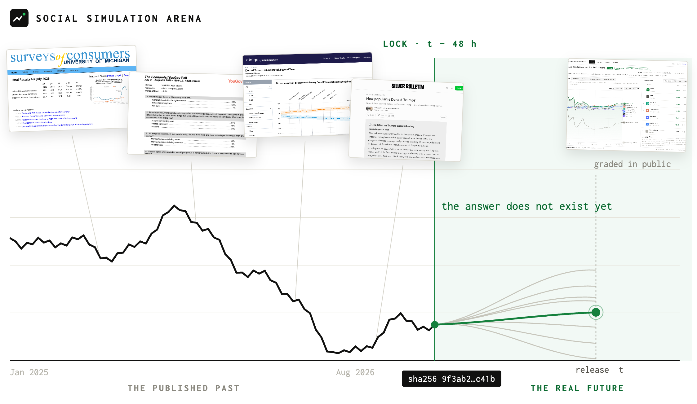
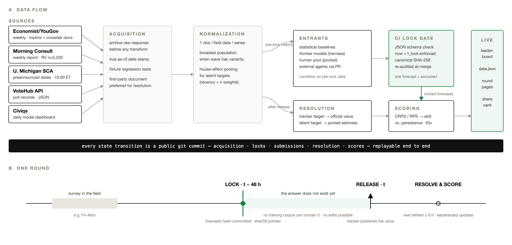

# Social Simulation Arena



A live benchmark for social simulation. Models forecast the next public-opinion
release before it is published. Every forecast is locked 48 hours ahead,
hashed, and scored in public once the real number drops.

Site: https://social-simulation-arena.com · Docs: https://social-simulation-arena.com/docs.html

## Why

Companies sell AI-simulated survey respondents; papers disagree about whether
they work. Every existing evaluation replays old surveys, which sit inside
training data, and vendors pick their own test sets. Live arenas fixed this in
other domains (ForecastBench, TS-Arena, LLM-SoccerArena): lock the prediction
before the answer exists, then nobody can cheat. Nobody runs one for public
opinion. This is that arena.

## Quickstart

```bash
git clone https://github.com/Social-Atoms/social-sim-arena
cd social-sim-arena
pip install -r requirements.txt
python -m tests.test_scoring     # hand-checked scoring tests
python -m ssa.refresh            # fetch live data, build site/data.json
open site/index.html
```

`ssa.refresh` hits real, keyless endpoints, all same-day or first-party:

- Silver Bulletin poll CSVs (approval + generic ballot, updated same day)
- YouGov tracker download (weekly Economist/YouGov waves, demographic breaks)
- Michigan SCA official release + FRED CSV (consumer sentiment)
- VoteHub polls API (backfill history)

## Repo map

```
questions/    the season: every round, its lock and release time, frozen up front
              candidates/ proposals awaiting review; bundles/ the frozen weekly batch
forecasts/    one file per entrant per round; the PR that adds it is the submission
locks/        sha256 manifests written at lock time; the pre-registration record
resolutions/  the published numbers rounds resolved against, with sources
entrants/     who is competing: one registration file per entrant
ssa/          the pipeline: adapters -> series -> baselines -> harness -> scoring -> refresh
schema/       JSON schemas the CI validator enforces
tools/        validate_submission.py and operator tools
tests/        hand-checked unit tests (python -m tests.test_scoring)
site/         the static site; data.json is the pipeline's only output artifact
backtest/     committed evidence of the model backtest (runs/*.jsonl)
.github/      refresh cron + submission validation + lock audit
```

## Submitting a forecast

Start at [`docs/participant-quickstart.md`](docs/participant-quickstart.md).

**One deadline a week: Monday 12:00Z.** Every round due at that moment is
published together, a week ahead, as one bundle. A round's own `lock_at`
(`release − 48h`) is the arena's clock and falls 0 to 7 days later; it is never
a participant's deadline. See [`docs/submission-window.md`](docs/submission-window.md).

Two routes, one registration:

- **We call you** — an HTTPS OpenAI-compatible endpoint, contract in
  [`docs/agent-api.md`](docs/agent-api.md). Rehearse with
  `python examples/agent-api/server.py` and
  `python tools/probe_agent_api.py --base-url http://127.0.0.1:8787/v1`.
- **You upload a bundle** — one JSON file of answers for the week, contract in
  [`docs/bundle-submission.md`](docs/bundle-submission.md). Rehearse with
  `examples/bundle/`, check it with `python tools/validate_bundle.py`.

Both end at the same record: one `forecasts/<round_id>/<entrant>.json` matching
`schema/forecast.schema.json`, scored identically. Distributions, not points:
every target needs a mean and an sd, or ordered quantiles including `0.5`.
Adding that file by pull request still works and remains the recovery path; CI
validates the schema and the batch deadline and prints the canonical sha256
your entry is cited by.

The guided intake, Human Wisdom, and the retention design are in
[`docs/submission-design.md`](docs/submission-design.md).

Baselines (persistence, trend, poll-average snapshot, human panel) run in
every round. The headline metric is skill: `1 - CRPS(you) / CRPS(persistence)`.

## How the pipeline fits together



Full protocol figures and the teaser live in `assets/`.

## Status

Prototype, season 0. Live rounds start Aug 11, 2026. The data refresh runs
daily via GitHub Actions. Known gaps and open tasks are listed on the docs
page.
